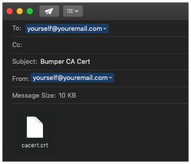
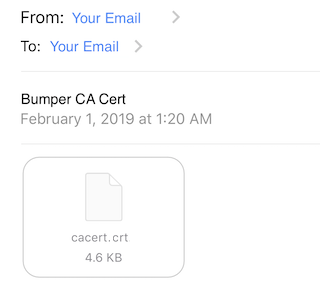

# Bumper 
A standalone implementation of the central server used by Ecovacs Deebot cleaning robots to relay data between the robot and client.

*Please note: this software is experimental and not ready for production use. Use at your own risk.* 

## Compatibility
As work to reverse the protocols and provide a self-hosted central server is still in progress, Bumper has had limited testing.  There are a number of EcoVacs models and varying protocols that it hasn't been tested against.  So far two different protocols have been seen, **XMPP** and **MQTT**.  Bumper should be compatible with most wifi-enabled robots that use the Ecovacs Android app, but has only been reported to work on the below:

| Model | Protocol Used |
|--|--|
| Deebot M81 Pro | XMPP |
| Deebot 900/901 | MQTT |

For more information about the protocols and how it works, see the [How does it work?](#how-does-it-work) section at the end.  If you test against another model and it works, please report it so it can be added to the list.

## Why?
For fun, mostly :)

But seriously, there are a several reasons for eliminating the central server:

1. Convenience: It works without an internet connection or if Ecovacs servers are down
2. Performance: No need for messages to travel to Ecovacs server and back.
3. Security: We can completely isolate the robot from the public Internet.

## Requirements
- An Ecovacs wifi-enabled robot
- A computer on your local network to run the Bumper server
- Python 3 and pipenv
- A network router that has functionality for overriding DNS queries
- A client that can connect to Bumper and talk to the robot over the Ecovacs protocol.
  - The Android or iOS apps can be used if configured properly. See [Using with the official Android/iOS App](#using-with-the-official-androidios-app) below.
  - [Sucks](https://github.com/wpietri/sucks) can also be used, which can act as a client and control the robots via command-line.

## Usage
 - Run `pipenv install` to install dependencies
 - Configure your Ecovacs vacuum using the official mobile app (if you haven't done this already)
### DNS
You need to configure your router to point DNS locally to where Bumper is running.  
The easiest way is overriding the main domains used by EcoVacs using DNSMasq/PiHole, by adding address entries in a custom config:

    address=/ecouser.net/{bumper server ip}
    address=/ecovacs.com/{bumper server ip}

If this isn't an option, you'll need to configure your router DNS to point a number of domains used by the app/robot to the Bumper server.  
**Note:** Depending on country, your phone may be using a different domain.  Most of these domains contain country-specific placeholders.
  - Example: If you see `eco-{countrycode}-api.ecovacs.com` and you live in the US/North America you would use: `eco-us-api.ecovacs.com`

| Address | Description |
|--|--|
| `lbo.ecovacs.net` | Load-balancer that is checked by the app/robot |
| `eco-{countrycode}-api.ecovacs.com` | Used for Login |
| `portal-{countrycode}.ecouser.net` | Used for Login and Rest API |
| `msg-{countrycode}.ecouser.net` | Used for XMPP |
| `mq-{countrycode}.ecovacs.com` | Used for MQTT |

### Starting Bumper
- Start Bumper with `pipenv run python bumper.py`

- Reboot your robot
	- **Note:** Some models may require removing and re-inserting the battery pack.
	- This doesn't seem to be required for models that don't have easily accessible batteries such as the 900/901.

- If your configuration is correct, the robot will connect to Bumper within about 30 seconds. Bumper will output information about the connection status. 

- Configure your client - see below.

## Using with Sucks
Instructions (verified to work with Sucks 0.8.3)
- Download and install [Sucks](https://github.com/wpietri/sucks)
- See the [example script](examples/sucks.py) for how to connect  

## Using with the official Android/iOS App 
Bumper *can* be used with the official app, but with limitations. Your phone needs to use your DNS server with custom settings, and you ***must*** import Bumper's CA cert and trust it before the app will work.  
### DNS
- Configure your DNS server as described above in the [DNS](#dns) section. 
### Import the Bumper CA Cert
- E-mail yourself the Bumper CA cert (located at `./certs/CA/cacert.pem`)

- Import the cert as a CA, and trust it
	- Instructions here are different for iPhone vs Android
##### Importing the CA Cert on iOS
- Open the e-mail on your iOS device, and click the attached cert

### Use the app
 
 - Open the app
 - At this time there is no authentication layer, you can enter any e-mail address and password (as long as it is 6 characters) and you will be authenticated
 - If your robot has already checked into Bumper, then it will be available in the list of robots  
- The app now does a ping to the robot to make sure it is online, and if it is you can now control the robot

## How does it work? 
**App/Authentication**

EcoVacs servers provide authentication of accounts and match those up to registered robots.  Once authenticated, users can control the robots via the app.  ***Bumper*** provides an implementation of the central servers providing authentication and matching.

**Robots**

So far two protocols have been identified that various models of EcoVacs robots use: **XMPP** and **MQTT**.  These appear to be mutually exclusive and your robot model will use one of these two protocols for communication.  ***Bumper*** provides an implementation of both protocols handling communication between the app and robots.

----
### Login/Authentication/RestAPI

***Bumper*** provides a fully simulated central server that handles login/authentication for the app/clients.  At this time no authentication layer is implemented and you can use any e-mail/password when logging in.  Future versions should add additional options here for security.

This means however, that once a robot has been configured to access your WiFi it never needs to communicate with EcoVac's servers again.

----
### XMPP

*Example Model:* Deebot M81 Pro

The robot utilizes XMPP for control.  When the robot boots up it sends a HTTP request to `lbo.ecovacs.net:8007` asking for the IP address and port of the XMPP server. Because of our DNS override, this request will be received by Bumper. We tell the robot to connect over XMPP to our local machine.

Both the app and robot connect to the central XMPP server, which relays messages between the app and robot.  The messages contain commands for the robot to execute or responses and statuses of the robot. 

***Bumper*** exposes a simulated XMPP server that implements the necessary functions for relaying messages between a robot and a client, acting as the central server.

**Note:** It's been observed that the apps will attempt to utilize XMPP regardless of robot model.  For models that utilize MQTT, no activity is performed over XMPP just pings.

----
### MQTT

*Example Model:* Deebot 900/901

The robot utilizes MQTT for control.  On startup it connects to an MQTT broker (`mq-{countrycode}.ecovacs.com`) and subscribes to a `p2p` topic where commands are issued.  
The app also connects to the MQTT broker and subscribes to a `attr` topic where the robot will periodically post status and location updates.

The app receives status updates, for example battery status or robot position information, periodically via the `attr` topic.

However, commands issued via the app/client are not published directly to the `p2p` topic that the robot subscribes to.  When the app sends a command such as "Clean", this is sent via a Rest API to the server at `portal-{countrycode}.ecouser.net`.

The Rest API provided by `portal-{countrycode}.ecouser.net` receives the command and passes it to a "helper" bot that has permission to publish to the `p2p` topic the robot is subscribed to.  The "helper" bot waits for a response to be published by the robot and then passes that response back to the server for the Rest API to send back as a response.

***Bumper*** provides a simulated RestAPI and "helper" bot, performing the same function as the central server above.

## Thanks
Bumper wouldn't exist without [Sucks](https://github.com/wpietri/sucks), an open source client for Ecovacs robots. Big thanks to @wpietri and contributors!
